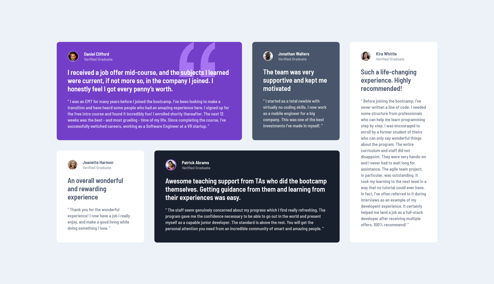
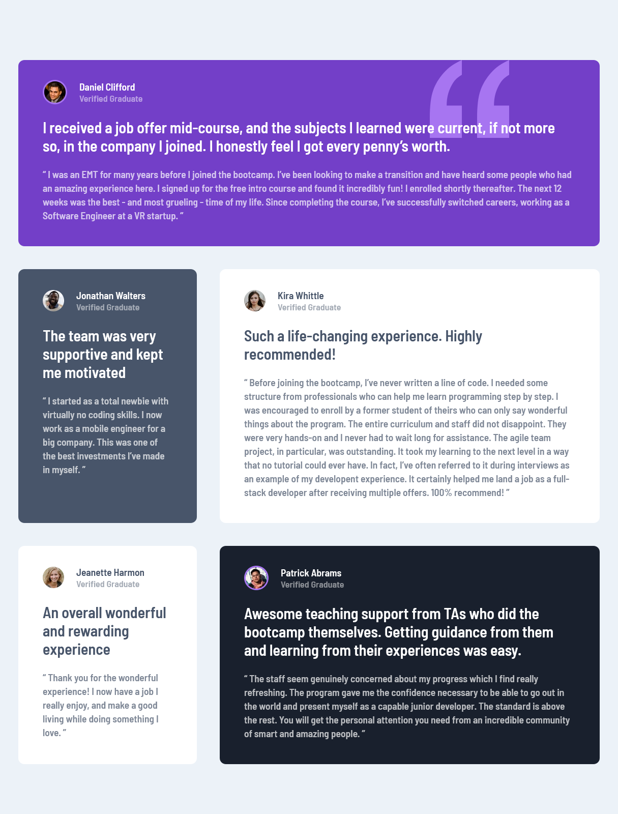

# Frontend Mentor - Testimonials grid section solution

This is my solution to the [Testimonials grid section challenge on Frontend Mentor](https://www.frontendmentor.io/challenges/testimonials-grid-section-Nnw6J7Un7). 

## Table of contents

- [Overview](#overview)
  - [Screenshot](#screenshot)
  - [Links](#links)
- [My process](#my-process)
  - [Built with](#built-with)
  - [What I learned](#what-i-learned)

## Overview

### Screenshot

### Links

- Solution URL: [https://www.frontendmentor.io/solutions/testimonials-grid-lEHdODvAIf](https://www.frontendmentor.io/solutions/testimonials-grid-lEHdODvAIf)
- Live Site URL: [https://testimonials-grid-section-seven-gamma.vercel.app/](https://testimonials-grid-section-seven-gamma.vercel.app/)

## My process

### Built with

- Semantic HTML5 markup
- CSS custom properties
- Flexbox
- CSS Grid

### What I learned

This project was a great opportunity for me to explore the power and possibilities of css grid. I applied ‘grid-template-area’ to create a neat and responsive testimonials grid layout. I have improved my css grid skills and I look forward to using it more in future projects.

